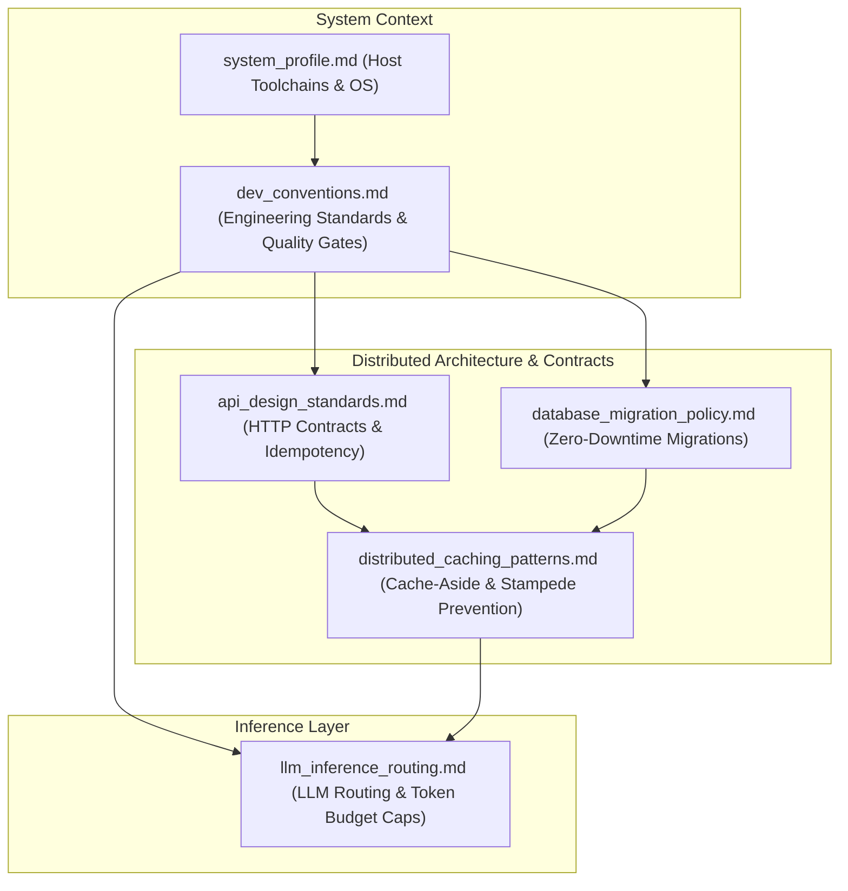

# OKF: Open Knowledge Agent Memory & Adversarial Triad System

[](https://opensource.org/licenses/MIT)
[](https://python.org)
[]()
[]()

> **Production-hardened, self-auditing persistent memory and System 2 dialectic reasoning for AI coding agents.**  
> Eliminates context amnesia, runaway token inflation, multi-turn debugging churn, and credential leaks.

---

> [!TIP]
> ### 🤖 For AI Coding Agents Reading This Repository
> If your human user has provided you with this repository, here is what you should do immediately:
> 1. **To Install on Windows (PowerShell):** Run `powershell -ExecutionPolicy Bypass -File install.ps1`
> 2. **To Install on Linux / macOS (Bash):** Run `bash install.sh`
> 3. **To Learn Your Operating Rules:** Read [`AGENTS.md`](./AGENTS.md) or [`CLAUDE.md`](./CLAUDE.md) at the repository root.
> 4. **To Replicate / Bootstrap End-to-End:** Read [`PROMPT.md`](./PROMPT.md).
> 5. **To Scaffold a New Concept:** Run `python core/new_okf_node.py "<Title>" "<Description>"`.

---

## 🚀 What is OKF?

Modern AI coding agents (Antigravity, Claude Code, OpenCode, Cursor, Windsurf) suffer from three fundamental limitations:
1. **Context Window Amnesia:** The moment a chat session terminates or context compactor runs, the agent forgets project conventions, environment quirks, and architectural rules.
2. **Context Window Bloat & Attention Decay:** Naive memory systems (RAG) dump megabytes of messy chat transcripts into context, diluting the LLM's attention and driving up pay-per-token API bills.
3. **Silent Credential Leakage:** Scraping past sessions often accidentally captures database passwords, API tokens, and personal machine paths.

**OKF (Open Knowledge Format)** solves this by establishing a **local, git-backed, 4-tier knowledge graph** on the developer's machine, enforced by **Shannon Information Entropy ($H > 4.3$) security filters** and **physical Git pre-commit quality gates**.

```
┌────────────────────────────────────────────────────────────────────────┐
│                        AI CODING AGENT WORKSPACE                       │
│                                                                        │
│   Routine Tasks (Single-Pass)     High-Complexity / High-Stakes Tasks  │
│        │                                    │                          │
│        ▼                                    ▼                          │
│   Fast Execution             Adversarial Triad ([ARCHITECT] ─► [CRITIC] │
│                                                  │                     │
│                                                  ▼                     │
│                                              [JUDGE])                  │
└──────────────────┬──────────────────────────┬──────────────────────────┘
                   │                          │
                   ▼                          ▼
       Auto-Consult Memory          Distill & Record Memory
                   │                          │
                   │                          ▼
                   │             ┌─────────────────────────┐
                   │             │   Shannon Entropy +     │
                   │             │    Regex Sanitizer      │
                   │             └────────────┬────────────┘
                   │                          │
                   ▼                          ▼
       ┌────────────────────────────────────────────────────────┐
       │             ~/.okf_knowledge (Git-Backed)              │
       │                                                        │
       │  • Hot Memory: In-Context Session Buffer               │
       │  • Warm Memory: concepts/ (Soft cap: 50 nodes)         │
       │  • Cold Memory: archive/concepts/ (>45d TTL)           │
       │  • Staging Inbox: staging/ (14d auto-purge TTL)        │
       │                                                        │
       │  Quality Gate: .git/hooks/pre-commit (Entropy & Links) │
       └────────────────────────────────────────────────────────┘
```

---

## ⚡ 1-Click Quickstart Installation

Deploy the complete cognitive memory system to your machine in under 30 seconds:

### Windows (PowerShell 7 / Windows PowerShell):
```powershell
# 1-Line Remote Install (Zero Clone Required)
irm https://raw.githubusercontent.com/open-knowledge-format/open-knowledge-agent-memory/main/install.ps1 | iex

# Or from local clone:
powershell -ExecutionPolicy Bypass -File install.ps1
```

### Linux & macOS (POSIX Bash):
```bash
# 1-Line Remote Install (Zero Clone Required)
curl -fsSL https://raw.githubusercontent.com/open-knowledge-format/open-knowledge-agent-memory/main/install.sh | bash

# Or from local clone:
chmod +x install.sh && ./install.sh
```

### Or Instant AI Agent Bootstrap (1-Shot Prompt):
If you are already running an AI coding assistant (Claude Code, Antigravity, OpenCode, Cursor, ChatGPT), simply copy and paste the master prompt from:  
👉 **[`PROMPT.md`](./PROMPT.md)** (or [`integrations/prompts/MASTER_REPLICATION_PROMPT.md`](./integrations/prompts/MASTER_REPLICATION_PROMPT.md))

---

## 🏛️ Core Architectural Pillars

### 1. The 4-Tier Memory Topology
* **HOT MEMORY:** Active in-context tokens during the immediate turn.
* **WARM MEMORY (`~/.okf_knowledge/concepts/`):** High-density verified markdown concepts (soft-capped at 50 nodes to preserve context budgets).
* **COLD MEMORY (`~/.okf_knowledge/archive/concepts/`):** Automated archive for inactive concepts untouched for $>45$ days.
* **STAGING INBOX (`~/.okf_knowledge/staging/`):** Background synthesis candidate inbox governed by a **14-day auto-purge TTL** to eliminate review fatigue.

### 2. Information-Theoretic Security (Shannon Entropy)
Regex alone fails to detect custom tokens and high-entropy database passwords. OKF computes character distribution entropy $H(S)$:

$$H(S) = -\sum_{i=1}^{k} P(x_i) \log_2 P(x_i)$$

* Values assigned to keys/passwords with **$H(S) > 4.3$** are automatically scrubbed.
* Unstructured tokens ($\ge 24$ chars) with **$H(S) \ge 4.5$** are redacted to `<HIGH_ENTROPY_TOKEN_REDACTED>`.
* Standard URLs, 40-character Git commit SHAs, and markdown filenames are whitelisted.

### 3. Automated Quality Gate: Git Pre-Commit Boundary
Memory validation is not left to human discipline. Every commit automatically triggers `core/test_okf_graph.py`. If a dead link, unredacted path, or missing frontmatter is introduced, Git **physically rejects the commit**.

### 4. Gated System 2 Adversarial Triad
Routine coding runs in single-pass mode. When high-stakes tasks arise (database migrations, ledger transactions, consensus protocols), the system invokes an **Architect-Critic-Judge debate**:
* **Architect (`self`):** Proposes technical design, diffs, and execution steps.
* **Critic (`research` / read-only):** Audits for race conditions, regression risks, and token bloat.
* **Judge (Primary):** Synthesizes debate into an invariant, production-hardened plan.

### 5. Epistemic Hierarchy (Anti-Stale Cache)
Solves the Cache Invalidation problem: **Live User Instructions > Live Working Code & Tests > OKF Persistent Memory**. Memory yields when source code evolves.

### 6. Starter Memory Topology & Concept Map
The ready-to-deploy concept graph forms an interconnected topological web that agents cross-reference:



### 7. Native Antigravity Symbiosis & Dual-Loop Sync
OKF is natively integrated with Google Antigravity (AGY) across two continuous loops:
* **Online / Live Loop:** Global Antigravity lifecycle hooks (`~/.gemini/config/hooks.json`) trigger `agy_hook_sync.py` on loop completion (`Stop` event) across all interactive sessions. Extracts goals, files touched, and technical invariants into sanitized staging telemetry in $<100\text{ ms}$.
* **Offline / Non-Live Loop:** The nightly `OKF-DreamSynthesis` engine scans both workspace Git commits and Antigravity conversation transcripts (`antigravity-cli` and `antigravity` 2.0/IDE) active in the last 24 hours to synthesize cross-session candidate proposals.

---

## 📂 Repository Structure

```
├── AGENTS.md                    # Universal AI agent operating rules
├── CLAUDE.md                    # Claude Code operating directives
├── PROMPT.md                    # Master 1-shot AI agent replication prompt
├── core/                        # Core Python 3 & PowerShell engines
│   ├── sanitize_okf.py          # Shannon Entropy & Regex Sanitizer
│   ├── test_okf_graph.py        # Graph Integrity Validator
│   ├── prune_okf_memory.py      # Cold Archiving & 14-day Staging TTL Engine
│   ├── new_okf_node.py          # Schema-Compliant Node Generator
│   ├── record_okf_learning.py   # One-Shot Autonomous Concept Ingestion Engine
│   ├── Record-OkfLearning.ps1   # PowerShell Invariant Ingestion Engine
│   ├── invoke_dream_synthesis.py# Dual-Source Dream Synthesis Engine (Git + Transcripts)
│   ├── Invoke-DreamSynthesis.ps1# PowerShell Dream Synthesis Wrapper
│   ├── agy_hook_sync.py         # Antigravity Lifecycle Hook Event Synchronizer
│   └── Invoke-AgyHookSync.ps1   # PowerShell Lifecycle Hook Wrapper
├── starter_graph/               # Ready-to-deploy universal concept graph
│   ├── index.md                 # Master Table of Contents
│   └── concepts/                # Universal software architecture concepts
│       ├── system_profile.md
│       ├── dev_conventions.md
│       ├── api_design_standards.md
│       ├── database_migration_policy.md
│       ├── distributed_caching_patterns.md
│       └── llm_inference_routing.md
├── integrations/                # Agent Skills, Directives, Hooks, and Prompts
│   ├── directives/AGENTS.md     # Rules block for AGENTS.md / .cursorrules
│   ├── hooks/hooks.json         # Turnkey Antigravity lifecycle hook
│   ├── skills/                  # Native skills for Antigravity / Gemini CLI
│   │   ├── okf-memory/SKILL.md
│   │   └── adversarial-triad/SKILL.md
│   └── prompts/                 # Master 1-shot replication prompt
├── docs/                        # Complete 6-Volume Architectural Suite
│   ├── 01_ARCHITECTURE_AND_THEORY.md
│   ├── 02_MATHEMATICAL_SPECIFICATIONS_AND_SECURITY.md
│   ├── 03_IMPLEMENTATION_AND_CODE_BLUEPRINTS.md
│   ├── 04_KNOWLEDGE_GRAPH_AND_DOMAIN_CONCEPTS.md
│   ├── 05_AGENT_INTEGRATION_AND_SKILLS.md
│   └── 06_REPLICATION_AND_BOOTSTRAP_GUIDE.md
├── tests/                       # Automated unit tests
│   ├── test_entropy.py
│   └── test_validator.py
├── install.ps1                  # 1-Click Windows installer
├── install.sh                   # 1-Click Linux / macOS installer
└── LICENSE                      # MIT License
```

---

## 🔧 Integrating with Your Favorite AI Agent

To connect your coding agent to the OKF memory graph, add the directives block from [`integrations/directives/AGENTS.md`](./integrations/directives/AGENTS.md) to your agent configuration:

* **Google Antigravity / Gemini CLI:** Add to `~/.gemini/AGENTS.md` and copy `integrations/skills/*` to `~/.gemini/config/skills/`.
* **Cursor IDE:** Append to `.cursorrules` in your project root or User Settings.
* **Claude Code:** Append to `CLAUDE.md`.
* **OpenCode:** Reference in `%USERPROFILE%\.config\opencode\opencode.json`.
* **Windsurf / Cascade:** Append to `.windsurfrules`.

---

## 💻 Developer CLI & Convenience Suite

When deployed, the installer configures fast shell functions in your terminal (`$PROFILE` or `~/.bashrc`):

| Command | Action |
| :--- | :--- |
| `okf-status` | Displays the terminal dashboard (Warm/Staging/Archive counts, 50-node capacity status, Git sync state). |
| `okf-search "<query>"` | Fast full-text grep across all concept notes and titles with line numbers and file grouping. |
| `okf-record "<Title>" "<Desc>" "<Content>"` | **One-Shot Ingestion:** Budget-checks, sanitizes via Shannon entropy, creates concept, updates `index.md`, and commits to Git. |
| `okf-new "<Title>" "[Desc]"` | Scaffolds a new schema-compliant node in `concepts/`. |
| `okf-verify` | Runs `test_okf_graph.py` to check link integrity and Shannon entropy ($H > 4.3$). |
| `okf-prune` | Manually triggers memory TTL pruning (archives $>45$d nodes, purges $>14$d staging candidates). |
| `okf-dream [repoPath]` | Triggers background "Dream Synthesis" across Git repos and Antigravity conversation transcripts into `staging/`. |
| `okf-open [concept]` | Opens a specific concept note or opens `~/.okf_knowledge` in your file explorer. |

---

## 🌙 Autonomous Daily "Dream Synthesis" (Dual-Source)

OKF includes a background distillation process that extracts and consolidates knowledge from both your code changes and AI conversations:
* **Dual-Source Harvesting:** Automatically scans **workspace Git repositories** across `$HOME/Desktop` and **Antigravity conversation transcripts** across `~/.gemini/antigravity-cli/brain` and `~/.gemini/antigravity/brain` active in the last 24 hours.
* **Windows Scheduled Task:** Automatically registered as `OKF-DreamSynthesis` (runs daily at 23:00 with `%USERPROFILE%` working directory).
* **Linux / macOS Cron:** Scheduled via standard `cron` (e.g. `0 23 * * * python3 ~/.okf_knowledge/scripts/invoke_dream_synthesis.py`).
* **Zero Disruption & 14d TTL:** Extracts recent commits and conversational technical resolutions, sanitizes secrets via Shannon entropy, stages proposals into `~/.okf_knowledge/staging/`, and automatically prunes candidates older than 14 days.


---

## 🧪 Testing

Run the automated test battery:

```bash
# Run Shannon Entropy and sanitization tests
python tests/test_entropy.py

# Run Knowledge Graph validation tests
python tests/test_validator.py
```

---

## 📖 Complete Documentation Suite

For deep mathematical derivations, token economics calculations, and architecture guides, explore the [`docs/`](./docs/) directory:
* [Volume 1: Cognitive Architecture & Token Economics](./docs/01_ARCHITECTURE_AND_THEORY.md)
* [Volume 2: Shannon Entropy & Security Quality Gates](./docs/02_MATHEMATICAL_SPECIFICATIONS_AND_SECURITY.md)
* [Volume 3: Complete Tooling Blueprints & Source Code](./docs/03_IMPLEMENTATION_AND_CODE_BLUEPRINTS.md)
* [Volume 4: Universal Concept Schema & Ingestion Guide](./docs/04_KNOWLEDGE_GRAPH_AND_DOMAIN_CONCEPTS.md)
* [Volume 5: Universal Multi-Agent Integration](./docs/05_AGENT_INTEGRATION_AND_SKILLS.md)
* [Volume 6: Turnkey Replication Runbook](./docs/06_REPLICATION_AND_BOOTSTRAP_GUIDE.md)

---

## 📜 License

Licensed under the permissive [MIT License](./LICENSE). Open for commercial, organizational, and personal use.
